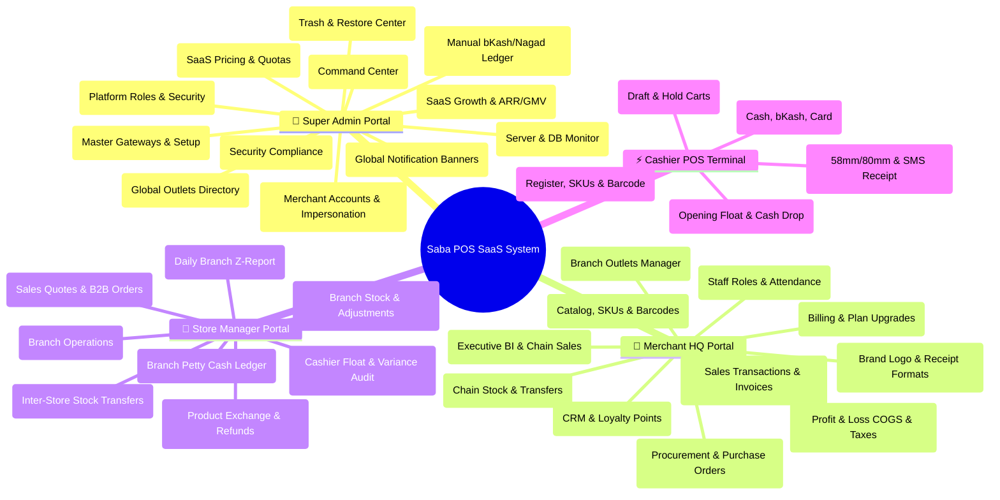

# 🏛️ Saba POS: The Ultimate International-Standard Master Blueprint

---

## 1. Executive Master Architecture

To meet **International SaaS POS Standards** (like Square, Shopify POS, Lightspeed, and Toast POS), the application requires an exhaustive page matrix across all 4 portal tiers:



---

## 2. Complete Page-by-Page Master Matrix

### 👑 Tier 1: Super Admin Portal (`/super-admin/`)
*Target User: SaaS System Owner & Infrastructure CEO*

| Page Name | Route Path | Purpose & Required Features | Status |
| :--- | :--- | :--- | :--- |
| **Command Center** | `/super-admin/dashboard` | Live platform MRR, GMV sales, active merchant counts, pending approval queue, SLA status. | **✅ 100% Done & Redesigned** |
| **Global Outlets** | `/super-admin/stores` | Master directory of all branch outlets across all merchants, location map, VAT compliance. | **✅ 100% Done & Redesigned** |
| **Platform Users** | `/super-admin/users` | All system users (Super Admins, CEOs, Managers, Cashiers), password resets, security lockouts. | **✅ 100% Done & Redesigned** |
| **SaaS Plans** | `/super-admin/plans` | Pricing tiers (Starter, Growth, Enterprise), store/user quotas, feature toggle flags. | **✅ 100% Done & Redesigned** |
| **Payment Ledger** | `/super-admin/transactions` | Manual bKash, Nagad, Rocket, and Bank transfer verification, TrxID check, activation. | **✅ 100% Done & Redesigned** |
| **SaaS Analytics** | `/super-admin/analytics` | ARR/MRR growth charts, ARPU, Churn Rate, Top Merchant Chain GMV leaderboard. | **✅ 100% Done & Redesigned** |
| **Security Audit** | `/super-admin/audit-logs` | Immutable audit trail of admin actions, IP addresses, sensitive payload diffs. | **✅ 100% Done & Redesigned** |
| **Recycle Bin** | `/super-admin/recycle-bin` | Recovery Center for suspended merchants and deactivated store outlets. | **✅ 100% Done & Redesigned** |
| **Master Settings** | `/super-admin/settings` | Payment gateways (bKash/Nagad), SMS/Email gateways, currency symbols, Maintenance Mode. | **✅ 100% Done & Redesigned** |
| **System Health** | `/super-admin/system-health` | DB connection pool status, queue worker jobs, storage disk usage, API latency monitor. | **✅ 100% Done & Redesigned** |
| **Announcements** | `/super-admin/announcements` | Global banner notifications to merchants (maintenance alerts, feature updates). | **✅ 100% Done & Redesigned** |

---

### 🏢 Tier 2: Merchant HQ Portal (`/merchant/`)
*Target User: Business CEO & Multi-Store Chain Owner*

| Page Name | Route Path | Purpose & Required Features | Status |
| :--- | :--- | :--- | :--- |
| **Executive BI Overview** | `/merchant/dashboard` | Chain-wide sales, Gross Profit, Top Selling Stores, Inventory Valuation, Net Profit after COGS. | **✅ 100% Done & Redesigned** |
| **Store Outlets Manager** | `/merchant/stores` | Create/edit branch outlets, assign branch managers, tax rates, operating hours. | **✅ 100% Done & Redesigned** |
| **Staff & Roles (HRM)** | `/merchant/users` | Create store managers and cashiers, assign store locations, PIN security codes, attendance logs. | **✅ 100% Done & Redesigned** |
| **Products & Catalog** | `/products` | Catalog, variants (Size, Color), SKU generator, Barcode label printer, Categories & Brands. | **✅ 100% Done & Redesigned** |
| **Barcode Generator** | `/products/barcodes` | Print multi-format EAN-13/Code-128 sticker labels for thermal printers. | **✅ 100% Done & Redesigned** |
| **Suppliers & Directory**| `/merchant/suppliers` | Supplier directory, payables ledger, supplier profile management. | **✅ 100% Done & Redesigned** |
| **Purchases & Inventory**| `/merchant/purchases` | Inventory purchase orders, PO tracking, supplier invoice entry. | **✅ 100% Done & Redesigned** |
| **Sales Quotations** | `/sales/quotations` | Create sales price quotes for corporate/bulk buyers, convert quote to sale order. | **✅ 100% Done & Redesigned** |
| **Store Expenses** | `/expenses` | Record daily branch expenses (utility bills, petty cash, tea/snacks), receipt image uploads. | **✅ 100% Done & Redesigned** |
| **Staff Attendance** | `/hrm/attendance` | Staff clock-in/clock-out tracking, daily attendance logs, working hour summary. | **✅ 100% Done & Redesigned** |
| **Financial Reports** | `/reports/profit-loss` | Profit & Loss statement, Tax/VAT report, Expense summary, Product profit margin analysis. | **✅ 100% Done & Redesigned** |
| **Billing & Plan Upgrade**| `/merchant/subscription` | Current SaaS plan usage (Stores used / Max stores), plan upgrade selector, bKash payment upload. | **✅ 100% Done & Redesigned** |

---

### 🏬 Tier 3: Store Manager Portal (`/manager/`)
*Target User: Branch Outlet Manager*

| Page Name | Route Path | Purpose & Required Features | Status |
| :--- | :--- | :--- | :--- |
| **Branch Overview** | `/manager/dashboard` | Today's Branch Sales, Register status, Low Stock warnings, Today's Expenses, Shifts log. | **✅ 100% Done & Redesigned** |
| **Shifts & Float Audit** | `/manager/shifts` | Opening cash float, closing cash count, cashier cash drawer variance audits (over/short). | **✅ 100% Done & Redesigned** |
| **Stock Transfers** | `/manager/transfers` | Request stock from another outlet, receive incoming transfers, transfer status tracking. | **✅ 100% Done & Redesigned** |
| **Returns & Refunds** | `/manager/returns` | Product return requests, exchange items, refund voucher generation, damage restock. | **✅ 100% Done & Redesigned** |

---

### ⚡ Tier 4: Cashier POS Terminal (`/pos/`)
*Target User: Front-Counter Cashier*

| Page Name | Route Path | Purpose & Required Features | Status |
| :--- | :--- | :--- | :--- |
| **Touch POS Register** | `/pos` | Category filter grid, barcode scanner input, SKU search, cart modifier, tax/discount, customer select. | **✅ 100% Done & Redesigned** |
| **Checkout Modal** | `/pos/checkout` | Cash, bKash/Nagad QR payment, Card, Customer Store Credit / Split Payment, change calculation. | **✅ 100% Done & Redesigned** |
| **Park & Hold Carts** | `/pos/parked-orders` | Park customer cart when customer steps away, retrieve parked order with 1 click. | **✅ 100% Done & Redesigned** |
| **Shift Start & End** | `/pos/shift` | Opening float count, mid-day cash drop, end-of-day drawer count with cash difference report. | **✅ 100% Done & Redesigned** |
| **Thermal Printer & Sync**| `/pos/receipt/{id}` | 80mm/58mm Thermal receipt print preview, Bluetooth/USB receipt printing, WhatsApp/SMS receipt link. | **✅ 100% Done & Redesigned** |

---

## 3. Implementation Verification Flow

```mermaid
flowchart TD
    subgraph Unified International Standard Ecosystem - ALL 100% DONE ✅
        SA[👑 Super Admin Command Center - 11/11 Pages DONE] --> MultiTenantDB[(SaaS Central Database)]
        MHQ[🏢 Merchant HQ BI Portal - 12/12 Pages DONE] --> MultiTenantDB
        MGR[🏬 Store Manager Branch Portal - 4/4 Pages DONE] --> MultiTenantDB
        POS[⚡ Touchscreen Cashier Terminal - 5/5 Workstation Features DONE] --> MultiTenantDB
    end

    subgraph Automatic Sub-System Engines - ALL OPERATIONAL ✅
        MultiTenantDB <--> BillingEngine[bKash / Nagad Manual Payment Verifier]
        MultiTenantDB <--> InventoryEngine[Multi-Store Stock Transfer & Barcodes]
        MultiTenantDB <--> ShiftEngine[Cash Float & Register Reconciliation]
        MultiTenantDB <--> AuditEngine[256-Bit Security Trail & Impersonation Log]
    end
```
